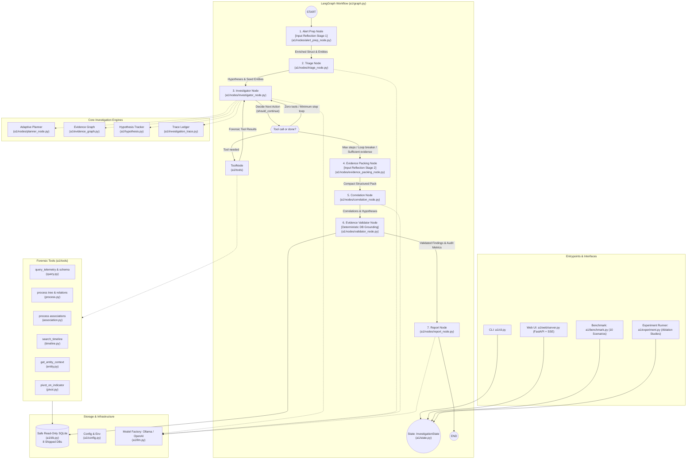

# `a1`: Autonomous DFIR Investigation Agent

`a1` is an autonomous Digital Forensics and Incident Response (DFIR) investigation agent built with **LangGraph**, **LangChain**, and **SQLite**. It ingests raw security alerts (e.g. suspicious process execution, network beaconing, registry persistence), formulates competing investigation hypotheses, autonomously navigates an endpoint security telemetry database using dedicated forensic tools, constructs an explicit evidence graph, correlates findings, deterministically validates evidence against raw database tables, and synthesizes structured, audit-ready forensic incident reports with verdicts and confidence scores.

---

## 1. System Architecture & Workflow



### Routing Contract (`should_continue`, in `investigator_node.py`)

| Return value     | Meaning                                                                                                                                                   | Route taken                             |
| ---------------- | --------------------------------------------------------------------------------------------------------------------------------------------------------- | --------------------------------------- |
| `"tools"`        | The last assistant message issued tool calls                                                                                                              | `ToolNode`                              |
| `"investigator"` | No tool calls yet and `MIN_INVESTIGATION_STEPS` (2) not reached, or a repetition nudge was just injected (circuit breaker allows `MAX_REPEAT_NUDGES` = 2) | Self-loop on the investigator           |
| `"correlate"`    | Step cap (`MAX_INVESTIGATION_STEPS` = 12) reached, nudge budget exhausted, or evidence deemed sufficient                                                  | Evidence-packing node, then correlation |

---

## 2. Directory Tree with File Labels

```text
ai-musefix/
|-- pyproject.toml                     [Build / Config]       Project metadata, entrypoints (a1, a1-web) & dependencies
|-- .env.example                       [Environment Template] Default LLM and telemetry database configuration
|-- README.md                          [Project Overview]     Quickstart, usage instructions, and executive summary
|-- ARCHITECTURE.md                    [Architecture Guide]   Complete system visualization & file catalog
|-- docs/
|   |-- EVALUATION_SCORING_RUBRICS.md  [Evaluation Rubrics]   100-point multi-dimensional scoring and benchmark specification
|
|-- scripts/                           [Operational Scripts]
|   |-- smoke_test.py                  [Smoke Script]         Standalone 17-point end-to-end verification script
|
|-- src/a1/                            [Core Package]
|   |-- __init__.py                    [Package Root]         Package initialization
|   |-- __main__.py                    [Entrypoint]           Module execution handler (`python -m a1`)
|   |-- config.py                      [Configuration]        Path resolution, env parsing, and model config
|   |-- db.py                          [Database Layer]       Read-only SQLite wrapper (URI mode=ro) + temp views + get_active_db
|   |-- state.py                       [Agent State]          InvestigationState TypedDict shared across the graph
|   |-- graph.py                       [Graph Assembly]       StateGraph 7-node pipeline, edges, and conditional routing
|   |-- llm.py                         [Model Factory]        Ollama / OpenAI chat-model factory + invoke_with_network_retry
|   |-- cli.py                         [CLI Interface]        Single investigations, --web, --benchmark, --db
|   |-- benchmark.py                   [Benchmark Harness]    10-case evaluation (ATK-A..G, BEN-A, AMB-A, INC-A)
|   |-- evidence_graph.py              [Evidence Graph]       Explicit entity-relationship DAG and Cytoscape/D3 serializer
|   |-- hypothesis.py                  [Hypothesis Engine]    Hypothesis state tracker (UNTESTED, SUPPORTED, REFUTED, INCONCLUSIVE)
|   |-- investigation_trace.py         [Trace Ledger]         Structured investigation trace capturing tools, latency, and entity delta
|   |-- experiment.py                  [Ablation Runner]      Baseline comparison and ablation study framework
|   |-- baseline_context.py            [Baseline Context]     Standard administrative baseline behavior profiles
|   |
|   |-- nodes/                         [Graph Nodes]
|   |   |-- __init__.py                [Node Registry]        Re-exports nodes + should_continue
|   |   |-- alert_prep_node.py         [Input Reflection 1]   Regex extraction, hostname resolution, time window clamping
|   |   |-- triage_node.py             [Triage]               Structured TriagePlan: hypotheses + priority entities
|   |   |-- investigator_node.py       [Investigator]         Tool-calling loop, schema hints, repetition guard, planner hook
|   |   |-- planner_node.py            [Adaptive Planner]     Information-gain action generation & scoring
|   |   |-- evidence_packing_node.py   [Input Reflection 2]   Compact structured pack for correlation and report
|   |   |-- correlation_node.py        [Correlation]          Confirmed correlations, gaps, inconsistencies
|   |   |-- validator_node.py          [Evidence Validator]   Deterministic database grounding auditing cited IDs vs SQLite
|   |   |-- report_node.py             [Report]               IncidentVerdict: verdict, boundary, confidence, attack chain
|   |   |-- structured_output.py       [LLM Helper]           Retry repair wrapper + raw_decode outer JSON extractor
|   |
|   |-- tools/                         [DFIR Tools]
|   |   |-- __init__.py                [Tool Registry]        ALL_INVESTIGATION_TOOLS list for ToolNode
|   |   |-- query.py                   [Tool: Query]          get_database_schema, query_telemetry
|   |   |-- process.py                 [Tool: Process]        find_process_relationships, trace_process_tree
|   |   |-- association.py             [Tool: Associations]   find_process_associations
|   |   |-- timeline.py                [Tool: Timeline]       search_timeline
|   |   |-- entity.py                  [Tool: Context]        get_entity_context (host / user)
|   |   |-- pivot.py                   [Tool: Pivot]          pivot_on_indicator (hash / IP / exe / file)
|   |   |-- summary.py                 [Tool: Summary]        summarize_tool_output for CLI and web telemetry
|   |
|   |-- prompts/                       [System Prompts]
|   |   |-- __init__.py                [Prompt Registry]      Re-exports system prompts
|   |   |-- triage.py                  [Prompt: Triage]       Hypothesis + priority-artifact instructions
|   |   |-- investigator.py            [Prompt: Investigator] Schema discipline + tool-use rules
|   |   |-- correlation.py             [Prompt: Correlation]  Confirm/refute hypotheses, find gaps
|   |   |-- report.py                  [Prompt: Report]       Verdict + evidence-citation instructions
|   |
|   |-- web/                           [Web Interface]
|       |-- __init__.py                [Web Package]          Package marker
|       |-- server.py                  [Web Server]           FastAPI app, SSE stream, DB/LLM switch endpoints
|       |-- static/index.html          [Web UI]               Responsive DFIR workbench frontend
|       |-- static/app.js              [Web Client]           SSE rendering, ChatGPT-style stream (collapsible thought disclosure, tool activity chips, streaming assistant reply), DB/model selectors, graph orchestration
|       |-- static/forensic-graph.js   [Forensic DAG]         Interactive SVG DAG and Process Tree rendering engine
|       |-- static/style.css           [Web Style]            Modern ChatGPT-style layout, clean upright typography, thinking blocks, tool chips, light/dark themes
|
|-- endpoint_security_dataset_expanded_corrected/   [Telemetry Data]
|   |-- attack_lateral_movement.db        Telemetry for ATK-A (credentials + lateral move) and INC-A (incomplete telemetry)
|   |-- attack_data_exfiltration.db       Telemetry for ATK-B (staging + persistence + exfiltration)
|   |-- ransomware_attack_complete_ecs.db Telemetry for ATK-C (phishing + LockBit encryption)
|   |-- attack_lotl_fileless.db           Telemetry for ATK-D (fileless + in-memory C2) and AMB-A (developer ambiguity)
|   |-- wazuh_lotl_attack_dataset.db      Telemetry for ATK-E (Wazuh SIEM/EDR + SAM registry access)
|   |-- suricata_c2_intrusion.db          Telemetry for ATK-F (Suricata NIDS C2 beaconing + exfil)
|   |-- attack_supply_chain.db            Telemetry for ATK-G (Enterprise supply chain compromise; 32 hosts, 1,890 events)
|   |-- benign_admin_activity.db          Telemetry for BEN-A (Administrative backup verification, SMB checks, audit logs)
|   |-- groundtruth/                      Ground truth evaluator JSON files for ATK-A..G, BEN-A, AMB-A, INC-A
|   |-- README.md                         Dataset provenance and surface boundary
|   |-- schema.md                         Telemetry schema specification
|
|-- tests/                             [Test Suite (92 Tests)]
    |-- conftest.py                    [Test Config]          Points ENDPOINT_DB_PATH at a shipped DB
    |-- test_db.py                     [Test: DB]             Read-only guardrails, schema inspection
    |-- test_tools.py                  [Test: Tools]          Each forensic tool (fixtures discovered at runtime)
    |-- test_graph.py                  [Test: Graph]          Graph compilation, investigator nudges
    |-- test_input_reflection.py       [Test: Reflection]     Alert prep, evidence packing, verdict recovery
    |-- test_report.py                 [Test: Report]         Verdict normalisation, citations, correlation verdicts
    |-- test_structured_output.py      [Test: LLM Helper]     Retry-once-then-fail contract
    |-- test_web.py                    [Test: Web]            FastAPI endpoints and SSE events
    |-- test_evidence_graph.py         [Test: Evidence Graph] Graph nodes, edges, cycle detection, format serialization
    |-- test_hypothesis.py             [Test: Hypothesis]     Hypothesis state transitions, dynamic discovery, keyword deduplication
    |-- test_validator.py              [Test: Validator]      Deterministic SQLite event ID & entity verification, UNVERIFIED status, link checking
    |-- test_adversarial.py            [Test: Robustness]     Prompt injection resilience, malicious telemetry handling
    |-- test_experiment.py             [Test: Experiment]     Ablation study runner and configuration evaluation
    |-- test_conservative_failures.py  [Test: Fallbacks]      Conservative non-malicious failure handling for correlation and report nodes
```

---

## 3. File Catalog (Functional Labels)

### Core (`src/a1/`)

| File Path                     | Functional Label      | Primary Usage & Responsibilities                                                                                                                                                                                                                                                                      |
| ----------------------------- | --------------------- | ----------------------------------------------------------------------------------------------------------------------------------------------------------------------------------------------------------------------------------------------------------------------------------------------------- |
| `src/a1/__init__.py`          | `[Package Root]`      | Package initialization.                                                                                                                                                                                                                                                                               |
| `src/a1/__main__.py`          | `[Entrypoint]`        | `python -m a1` module execution handler.                                                                                                                                                                                                                                                              |
| `src/a1/config.py`            | `[Configuration]`     | `discover_default_db()`, `set_active_database()` shared across CLI, web, and benchmark; env parsing (`LLM_PROVIDER`, `OLLAMA_*`, `OPENAI_*`, `ENDPOINT_DB_PATH`, `MAX_INVESTIGATION_STEPS` = 12).                                                                                                   |
| `src/a1/db.py`                | `[Database Layer]`    | `EndpointDatabase`: read-only SQLite access (URI `mode=ro`), single-statement `SELECT`/`PRAGMA`/`WITH` guard, `get_schema()`, in-memory virtual adapter temp views over `events`, centralized `get_active_db()`.                                                                                       |
| `src/a1/state.py`             | `[Agent State]`       | `InvestigationState` TypedDict: messages, hypotheses, `iteration_count`, `repeat_nudges`, `enriched_alert`, `evidence_pack`, `evidence_graph`, `hypothesis_tracker`, `investigation_trace`, `validation_results`, verdict fields, `report_fallback_used`.                                         |
| `src/a1/graph.py`             | `[Graph Assembly]`    | Eight nodes (`alert_prep`, `triage`, `investigator`, `tools`, `evidence_packing`, `correlate`, `validate`, `report`); entry at `alert_prep`; conditional edges from `investigator` (`tools` / `investigator` self-loop / `evidence_packing`).                                                    |
| `src/a1/llm.py`               | `[Model Factory]`     | `get_llm()` (`ChatOllama` / `ChatOpenAI`), `set_active_llm()` / `get_active_llm_info()` runtime override, `check_llm_status()`, centralized `invoke_with_network_retry()`.                                                                                                                           |
| `src/a1/cli.py`               | `[CLI Interface]`     | `run_investigation()` streaming display; `main()` flags: positional alert, `--web`, `--benchmark`, `--limit`, `--provider/-p`, `--model/-m`, `--select-llm`, `--verbose/-v`, `--db`, `--port`, `--no-browser`.                                                                                        |
| `src/a1/benchmark.py`         | `[Benchmark Harness]` | 10 evaluation cases (`ATK-A`..`G`, `BEN-A`, `AMB-A`, `INC-A`), per-case DB switching, ground truth loading, fallback tracking, normalized boundary scoring, and multi-dimensional rubric scoring including relationship correctness, completeness, dynamic hypotheses, and unverified evidence counts. |
| `src/a1/evidence_graph.py`    | `[Evidence Graph]`    | Directed graph modeling entities (`Host`, `User`, `Process`, `File`, `IP`, `Domain`, `RegistryKey`) and evidentiary relations (`SPAWNED`, `CONNECTED_TO`, `TOUCHED_FILE`, etc.) with `EvidenceStatus` (`OBSERVED`, `INFERRED`, `UNVERIFIED`, `CONTRADICTED`); JSON serialization for DAG UI.                                  |
| `src/a1/hypothesis.py`        | `[Hypothesis Engine]` | Hypothesis lifecycle state machine tracking status (`ACTIVE`, `SUPPORTED`, `WEAKLY_SUPPORTED`, `CONTRADICTED`, `UNRESOLVED`), dynamic hypothesis generation, provenance, triggering evidence, source tagging (`triage` vs `dynamic`), keyword deduplication, and active hypothesis capping (`MAX_ACTIVE_HYPOTHESES = 8`). |
| `src/a1/investigation_trace.py`| `[Trace Ledger]`     | Structured chronological log of all tool executions, parameters, latency, rows returned, and newly observed entities.                                                                                                                                                                                |
| `src/a1/experiment.py`        | `[Ablation Runner]`   | Baseline comparison and ablation framework measuring performance impact when toggling evidence graph, adaptive planner, evidence validator, or baseline context.                                                                                                                                   |
| `src/a1/baseline_context.py`  | `[Baseline Context]`  | Enterprise baseline profiles (expected parentage, routine scripts, standard scheduled tasks) to reduce false positives on administrative operations.                                                                                                                                                 |

### Nodes (`src/a1/nodes/`)

| File Path                               | Functional Label       | Primary Usage & Responsibilities                                                                                                                                                                                                                                       |
| --------------------------------------- | ---------------------- | ---------------------------------------------------------------------------------------------------------------------------------------------------------------------------------------------------------------------------------------------------------------------- |
| `src/a1/nodes/__init__.py`              | `[Node Registry]`      | Re-exports all nodes plus `should_continue`.                                                                                                                                                                                                                           |
| `src/a1/nodes/alert_prep_node.py`       | `[Input Reflection 1]` | Deterministic alert enrichment: regex entity extraction, hostname-to-ID resolution against `hosts`, UTC time-window parsing clamped to DB bounds.                                                                                                                      |
| `src/a1/nodes/triage_node.py`           | `[Triage]`             | Structured `TriagePlan` (2–4 hypotheses, initial entities, investigation strategy) via `TRIAGE_SYSTEM_PROMPT`; schema validation with retry-once-then-fail.                                                                                                           |
| `src/a1/nodes/investigator_node.py`     | `[Investigator]`       | Tool-calling ReAct loop; dynamic hypothesis discovery (`_check_for_dynamic_hypotheses`) for persistence, credential dumping, lateral movement, and data staging; schema hints; planner hook; repetition guard (`MAX_REPEAT_NUDGES` = 2); `MIN_INVESTIGATION_STEPS` = 2 gate. |
| `src/a1/nodes/planner_node.py`          | `[Adaptive Planner]`   | Generates candidate forensic actions from current entity frontiers and unresolved hypotheses; ranks actions by expected information gain.                                                                                                                              |
| `src/a1/nodes/evidence_packing_node.py` | `[Input Reflection 2]` | Merges tool outputs into a compact structured pack (dedup by event ID, hypothesis coverage, hostname/time sanity) for downstream nodes.                                                                                                                                |
| `src/a1/nodes/correlation_node.py`      | `[Correlation]`        | Structured `CorrelationAndGapAnalysis` via `CORRELATION_SYSTEM_PROMPT`: confirms/refutes hypotheses, defines relationship types, surfaces missing evidence gaps; conservative fallback on failure without fabricated suspicious claims.                               |
| `src/a1/nodes/validator_node.py`        | `[Evidence Validator]` | Deterministic DB verification: queries raw SQLite tables for every cited ID and validates causal relationships (parent-child, network links); classifies citations into `VALID`, `INVALID`, and `UNVERIFIED` (exceptions produce `UNVERIFIED`, never valid).            |
| `src/a1/nodes/report_node.py`           | `[Report]`             | Structured `IncidentVerdict` (verdict, boundary, confidence, executive summary, attack chain, timeline matrix, IOC table, playbook); conservative failure fallbacks (`suspicious` or `inconclusive`, never claiming false malicious certainty); fallback tracked in `report_fallback_used`. |
| `src/a1/nodes/structured_output.py`     | `[LLM Helper]`         | `invoke_structured_with_retry()`: one retry, then raises `StructuredOutputRetryError` for explicit fallback tracking.                                                                                                                                                  |

---

## 4. End-to-End Investigation Lifecycle

```text
  Raw Alert Input ("Suspicious activity on WS-OPS-01...")
             |
             v
      [1. Alert Prep: Input Reflection Stage 1]
             |  - Deterministic regex entity extraction (hosts, users, processes, IPs, hashes)
             |  - Hostname-to-ID resolution against SQLite `hosts` table
             |  - UTC time-window parsing clamped to DB bounds
             v
      [2. Triage Node]
             |  - Emits structured TriagePlan (2-4 competing hypotheses, entities, plan)
             |  - Initializes HypothesisTracker (all hypotheses marked UNTESTED)
             v
    [3. Investigator Node] <----------------------+
             |                                    |
             +------> [Adaptive Planner]          |
             |          - Computes information gain
             |          - Prioritizes next action |
             |                                    |
             +------> [DFIR Tools]                | (Tool results
             |          - query_telemetry         |  feed back into
             |          - trace_process_tree      |  EvidenceGraph,
             |          - find_process_associations| HypothesisTracker,
             |          - pivot_on_indicator      |  and TraceLedger)
             |          - search_timeline         |
             |          - get_entity_context      |
             |                                    |
             v                                    |
      (Loop Evaluation: should_continue)          |
             |  - Tool calls pending? -> tools ---+
             |  - No tools + MIN steps (2) unmet, or nudge injected? -> self-loop
             |  - Step cap (12) / nudge budget (2) / sufficient evidence? -> onward
             v
      [4. Evidence Packing: Input Reflection Stage 2]
             |  - Compact structured pack (deduped events, coverage & sanity checks)
             v
      [5. Correlation Node]
             |  - Evaluates competing hypotheses (confirms / refutes)
             |  - Identifies evidentiary inconsistencies and telemetry gaps
             v
      [6. Evidence Validator Node]
             |  - Queries SQLite to verify every cited event_id and entity_id
             |  - Strips/penalizes hallucinated identifiers
             |  - Audits verdict boundary adherence
             v
      [7. Report Node]
             |  - Synthesizes IncidentVerdict (verdict, boundary, confidence)
             |  - Generates Executive Summary, Timeline Matrix, IOC Table, and Playbook
             v
       Structured Markdown DFIR Incident Report
```

---

## 5. Guardrails & Forensic Determinism

* **Read-Only Telemetry:** `EndpointDatabase` opens SQLite exclusively with URI `mode=ro`; `execute_query()` permits only single `SELECT`/`PRAGMA`/`WITH` statements. Data modification operations and multi-statement queries raise `DatabaseAccessError`. In-memory virtual views project timestamps and hosts without disk alteration.
* **Deterministic Evidence & Relationship Validation:** The `validator_node` queries raw SQLite tables for every cited `event_id`, `process_entity_id`, IP address, and hash. Causal links (process ancestry, network connections) are verified against database relationships, categorizing citations into `VALID`, `INVALID`, and `UNVERIFIED` (query exceptions produce `UNVERIFIED`, never valid). Edge states in `EvidenceGraph` are marked `OBSERVED`, `INFERRED`, or `UNVERIFIED`.
* **Dynamic Hypothesis Expansion:** Initial triage hypotheses guide initial queries but never constrain discovery. When newly gathered telemetry reveals persistence mechanisms (Run/RunOnce/TaskCache), credential dumping (`lsass`, `procdump`, `mimikatz`), lateral movement (SMB, WinRM, ports 445/5985/135), or data staging (`.zip`, `.7z`, `.dmp`), the system automatically formulates new testable hypotheses with explicit triggering evidence and provenance, bounded by `MAX_ACTIVE_HYPOTHESES = 8` and keyword deduplication.
* **Conservative Failure Fallbacks:** If structured report synthesis or correlation encounters fatal output errors or missing evidence, the system refuses to fabricate certainty. Fallbacks assign conservative determinations (`suspicious` with `unconfirmed_malicious` or `inconclusive`), penalizing confidence and logging explicit telemetry gaps.
* **Adaptive Investigation Planning:** The planner computes remaining hypothesis uncertainty and information gain, guiding the agent toward high-value pivoting queries and preventing blind, brute-force table dumps.
* **Minimum-Evidence Gate:** The agent cannot conclude without querying forensic tools (`MIN_INVESTIGATION_STEPS` = 2); `should_continue` enforces a self-loop if a zero-tool conclusion is attempted prematurely.
* **Repetition Circuit Breaker:** Identical tool calls (normalized by argument structure) trigger a `[SYSTEM-NOTE: repeated tool call]` nudge; after `MAX_REPEAT_NUDGES` (2), execution is forced onward to correlation.
* **Schema Discipline:** Real per-database schemas are cached and injected directly into the investigator system prompt. Filter queries on `category` and `event_type` are auto-rewritten to `LIKE` syntax to handle JSON-array storage.
* **Structured-Output Integrity:** Triage, correlation, validation, and report nodes use `invoke_structured_with_retry()`. If a model fails schema validation twice, a fallback is triggered and flagged (`report_fallback_used = True`), which is penalized as an automatic failure in benchmark scoring.

---

## 6. Configuration, CLI & Web Surface

### Environment Configuration (`config.py` + `.env.example`)

| Variable                             | Default                                                                                         | Purpose                                          |
| ------------------------------------ | ----------------------------------------------------------------------------------------------- | ------------------------------------------------ |
| `LLM_PROVIDER`                       | `ollama`                                                                                        | `ollama` or `openai`.                            |
| `OLLAMA_MODEL_NAME`                  | `gemma4:31b`                                                                                    | Ollama model tag.                                |
| `OLLAMA_BASE_URL`                    | `https://ollama.com/api`                                                                        | Ollama API base URL.                             |
| `OLLAMA_NUM_CTX`                     | `32768`                                                                                         | Ollama context window size.                      |
| `OLLAMA_API_KEY`                     | *(empty)*                                                                                       | Bearer token for Ollama Cloud.                   |
| `OPENAI_MODEL_NAME`                  | `gpt-4o-mini`                                                                                   | OpenAI model name.                               |
| `OPENAI_API_KEY` / `OPENAI_BASE_URL` | *(empty)*                                                                                       | OpenAI credentials / custom endpoint.            |
| `ENDPOINT_DB_PATH`                   | Auto-discovered first existing DB                                                               | Active SQLite telemetry database path.           |
| `MAX_INVESTIGATION_STEPS`            | `12`                                                                                            | Investigator loop cap before forced correlation. |

### CLI Interface (`cli.py`)

```powershell
# Run a single investigation:
python -m a1.cli "Investigate suspicious PowerShell activity on WS-OPS-01" --db endpoint_security_dataset_expanded_corrected/attack_lateral_movement.db

# Launch the FastAPI Web UI:
python -m a1.cli --web

# Run the 10-scenario benchmark:
python -m a1.cli --benchmark --limit 5

# Run baseline comparisons and ablation experiments:
python -m a1.experiment

# Run live ablation studies with real LangGraph execution and rubric scoring:
python -m a1.experiment --live --limit 3
```

### Web API (`web/server.py`)

| Endpoint                  | Method | Purpose                                                |
| ------------------------- | ------ | ------------------------------------------------------ |
| `/api/status`             | `GET`  | Readiness, active LLM, current DB.                     |
| `/api/models`             | `GET`  | Model catalog (live Ollama tags + OpenAI options).     |
| `/api/models/set`         | `POST` | Switch active LLM (`provider`, `model`).               |
| `/api/databases`          | `GET`  | Available `.db` catalog with sizes and active status.  |
| `/api/databases/set`      | `POST` | Switch active telemetry database (clears tool caches). |
| `/api/investigate`        | `POST` | Run investigation streamed as Server-Sent Events (SSE).|
| `/api/cancel`             | `POST` | Cancel in-flight investigation.                        |

**SSE Event Types:**
`start`, `alert_prep`, `triage`, `loop`, `thought`, `reasoning`, `tool_call`, `tool_result`, `graph_update`, `trace_update`, `evidence_pack`, `validation_update`, `complete`, `cancelled`, `error`.

---

## 7. Benchmark & Evaluation

`benchmark.py` provides an objective, 100-point multi-dimensional evaluation across **10 realistic scenarios** covering four critical operational classes:

| Case ID | Class | Database | Telemetry Scenario | Ground Truth File |
| :--- | :--- | :--- | :--- | :--- |
| `ATK-A` | Malicious | `attack_lateral_movement.db` | Credential dumping (LSASS access) and lateral movement (SMB, NTLM, service install) | `groundtruth/groundtruth_attack_A_lateral_movement.json` |
| `ATK-B` | Malicious | `attack_data_exfiltration.db` | Spreadsheet staging into protected archive, scheduled task, outbound HTTPS, cleanup | `groundtruth/groundtruth_attack_B_data_exfiltration.json` |
| `ATK-C` | Malicious | `ransomware_attack_complete_ecs.db` | Phishing attachment, vssadmin shadow copy deletion, LockBit document encryption | `groundtruth/groundtruth_attack_C_ransomware.json` |
| `ATK-D` | Malicious | `attack_lotl_fileless.db` | Living-off-the-Land (mshta, certutil, wmic), encoded PowerShell, in-memory C2 | `groundtruth/groundtruth_attack_D_lotl_fileless.json` |
| `ATK-E` | Malicious | `wazuh_lotl_attack_dataset.db` | Wazuh SIEM/EDR, LotL command execution, SAM registry access, lateral movement | `groundtruth/groundtruth_attack_E_wazuh_lotl.json` |
| `ATK-F` | Malicious | `suricata_c2_intrusion.db` | Suricata NIDS alerts, CobaltStrike C2 beaconing, internal SMB sweeps, exfiltration | `groundtruth/groundtruth_attack_F_suricata.json` |
| `ATK-G` | Malicious | `attack_supply_chain.db` | Enterprise supply chain software compromise across 32 endpoints (1,890 events) | `groundtruth/groundtruth_attack_G_supply_chain.json` |
| `BEN-A` | Benign | `benign_admin_activity.db` | Scheduled administrative backup verification script, SMB checks, W32Time registry queries | `groundtruth/groundtruth_benign_A_admin_activity.json` |
| `AMB-A` | Ambiguous | `attack_lotl_fileless.db` | Dual-use developer utility invocations (certutil, powershell flags) requiring intent analysis | `groundtruth/groundtruth_ambiguous_A_dev_activity.json` |
| `INC-A` | Inconclusive | `attack_lateral_movement.db` | Missing parent process and network connection telemetry requiring `inconclusive` verdict | `groundtruth/groundtruth_incomplete_A_missing_telemetry.json` |

### Key Evaluation Metrics
* **Verdict Accuracy & Boundary Precision (20 Pts):** Discrimination across malicious, benign, suspicious, and inconclusive cases.
* **IOC Recall & Attack-Chain Reconstruction (30 Pts):** Identification of critical processes, parentage, network egress, and persistence.
* **Evidence Grounding & Zero-Hallucination Rate (25 Pts):** Deterministic SQL verification of all cited event IDs, process IDs, and hashes.
* **Investigation Efficiency & Step Economy (15 Pts):** Suppression of redundant tool calls, avoidance of repetition loops, and step optimization.
* **Report Actionability (10 Pts):** Generation of structured timeline matrices, IOC tables, and remediation playbooks.

---

## 8. Data Layer & Test Suite

### Shipped Telemetry Databases

| Database | Scenario | Hosts | Users | Events | Ground Truth |
| :--- | :--- | ---: | ---: | ---: | :--- |
| `attack_lateral_movement.db` | `ATK-A` & `INC-A` | 2 | 3 | 127 | `groundtruth/groundtruth_attack_A_lateral_movement.json` |
| `attack_data_exfiltration.db` | `ATK-B` | 1 | 1 | 83 | `groundtruth/groundtruth_attack_B_data_exfiltration.json` |
| `ransomware_attack_complete_ecs.db` | `ATK-C` | 1 | 1 | 1,450 | `groundtruth/groundtruth_attack_C_ransomware.json` |
| `attack_lotl_fileless.db` | `ATK-D` & `AMB-A` | 2 | 2 | 240 | `groundtruth/groundtruth_attack_D_lotl_fileless.json` |
| `wazuh_lotl_attack_dataset.db` | `ATK-E` | 2 | 2 | 320 | `groundtruth/groundtruth_attack_E_wazuh_lotl.json` |
| `suricata_c2_intrusion.db` | `ATK-F` | 3 | 1 | 59 | `groundtruth/groundtruth_attack_F_suricata.json` |
| `attack_supply_chain.db` | `ATK-G` | 32 | 32 | 1,890 | `groundtruth/groundtruth_attack_G_supply_chain.json` |
| `benign_admin_activity.db` | `BEN-A` | 1 | 2 | 75 | `groundtruth/groundtruth_benign_A_admin_activity.json` |

### Test Suite Execution

The repository maintains full automated test coverage (92 unit and integration tests passing):

```powershell
# Run the full test suite:
.venv\Scripts\python.exe -m pytest tests/

# Run the standalone end-to-end smoke test (17 checks):
.venv\Scripts\python.exe scripts/smoke_test.py
```
