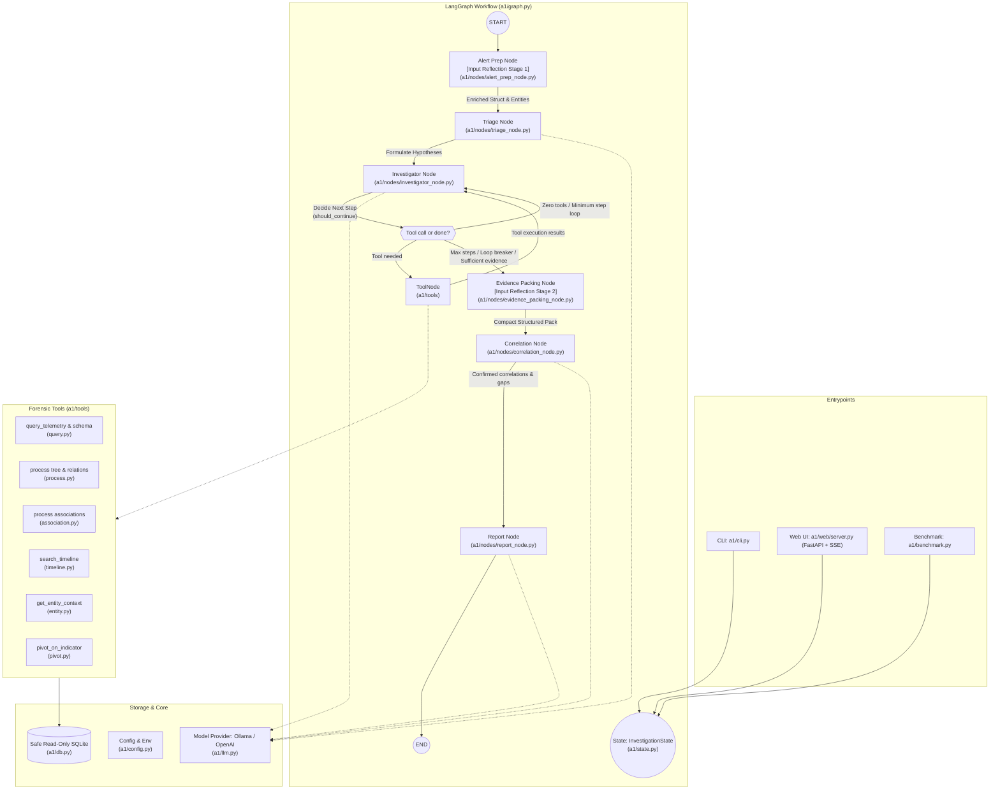

# `a1`: Autonomous DFIR Investigation Agent

`a1` is an autonomous Digital Forensics and Incident Response (DFIR) investigation agent built with **LangGraph**, **LangChain**, and **SQLite**. It takes raw security alerts (e.g. suspicious process execution, network beaconing, registry persistence), formulates investigation hypotheses, navigates an endpoint security telemetry database using dedicated forensic tools, correlates findings, and synthesizes structured forensic incident reports with verdicts and confidence scores.

---

## 1. System Architecture & Workflow



### Routing contract (`should_continue`, in `investigator_node.py`)

| Return value     | Meaning                                                                                                                                                   | Route taken                             |
| ---------------- | --------------------------------------------------------------------------------------------------------------------------------------------------------- | --------------------------------------- |
| `"tools"`        | The last assistant message issued tool calls                                                                                                              | ToolNode                                |
| `"investigator"` | No tool calls yet and `MIN_INVESTIGATION_STEPS` (2) not reached, or a repetition nudge was just injected (circuit breaker allows `MAX_REPEAT_NUDGES` = 2) | Self-loop on the investigator           |
| `"correlate"`    | Step cap (`MAX_INVESTIGATION_STEPS` = 12) reached, nudge budget exhausted, or evidence deemed sufficient                                                  | Evidence-packing node, then correlation |

---

## 2. Directory Tree with File Labels

```text
ai-musefix/
|-- pyproject.toml                     [Build / Config]       Project metadata, entrypoints & dependencies
|-- .env.example                       [Environment Template] Default LLM and telemetry database configuration
|-- README.md                          [Project Overview]     Quickstart, usage instructions, and summary
|-- ARCHITECTURE.md                    [Architecture Guide]   Complete system visualization & file catalog
|
|-- src/a1/                            [Core Package]
|   |-- __init__.py                    [Package Root]         Package initialization
|   |-- __main__.py                    [Entrypoint]           Module execution handler (`python -m a1`)
|   |-- config.py                      [Configuration]        Path resolution, env parsing, and model config
|   |-- db.py                          [Database Layer]       Read-only SQLite wrapper (URI mode=ro) + temp views
|   |-- state.py                       [Agent State]          InvestigationState TypedDict shared across the graph
|   |-- graph.py                       [Graph Assembly]       StateGraph nodes, edges, and routing
|   |-- llm.py                         [Model Factory]        Ollama / OpenAI chat-model factory + runtime override
|   |-- cli.py                         [CLI Interface]        Single investigations, --web, --benchmark, --db
|   |-- server.py                      [Web Entrypoint]       Argparse wrapper around a1.web.server:start
|   |-- benchmark.py                   [Benchmark Harness]    ATK-A / ATK-B labeled-scenario evaluation
|   |
|   |-- nodes/                         [Graph Nodes]
|   |   |-- __init__.py                [Node Registry]        Re-exports all six nodes + should_continue
|   |   |-- alert_prep_node.py         [Input Reflection 1]   Regex extraction, hostname resolution, time window
|   |   |-- triage_node.py             [Triage]               Structured TriagePlan: hypotheses + entities
|   |   |-- investigator_node.py       [Investigator]         Tool-calling loop, schema hint, repetition guard
|   |   |-- evidence_packing_node.py   [Input Reflection 2]   Compact structured pack for correlation/report
|   |   |-- correlation_node.py        [Correlation]          Confirmed correlations, gaps, inconsistencies
|   |   |-- report_node.py             [Report]               IncidentVerdict: verdict, confidence, attack chain
|   |   |-- structured_output.py       [LLM Helper]           Retry-once-then-fail wrapper for structured calls
|   |
|   |-- tools/                         [DFIR Tools]
|   |   |-- __init__.py                [Tool Registry]        ALL_INVESTIGATION_TOOLS list for ToolNode
|   |   |-- query.py                   [Tool: Query]          get_database_schema, query_telemetry
|   |   |-- process.py                 [Tool: Process]        find_process_relationships, trace_process_tree
|   |   |-- association.py             [Tool: Associations]   find_process_associations
|   |   |-- timeline.py                [Tool: Timeline]       search_timeline
|   |   |-- entity.py                  [Tool: Context]        get_entity_context (host / user)
|   |   |-- pivot.py                   [Tool: Pivot]          pivot_on_indicator (hash / IP / exe / file)
|   |
|   |-- prompts/                       [System Prompts]
|   |   |-- __init__.py                [Prompt Registry]      Re-exports the four system prompts
|   |   |-- triage.py                  [Prompt: Triage]       Hypothesis + priority-artifact instructions
|   |   |-- investigator.py            [Prompt: Investigator] Schema discipline + tool-use rules
|   |   |-- correlation.py             [Prompt: Correlation]  Confirm/refute hypotheses, find gaps
|   |   |-- report.py                  [Prompt: Report]       Verdict + evidence-citation instructions
|   |
|   |-- web/                           [Web Interface]
|       |-- __init__.py                [Web Package]          Package marker
|       |-- server.py                  [Web Server]            FastAPI app, SSE stream, DB/LLM switch endpoints
|       |-- static/index.html          [Web UI]               ChatGPT-style frontend
|       |-- static/app.js              [Web Client]            SSE rendering, DB/model selectors
|       |-- static/style.css            [Web Style]             Light/dark theme stylesheet
|
|-- endpoint_security_dataset_expanded_corrected/   [Telemetry Data]
|   |-- attack_lateral_movement.db        Telemetry for ATK-A (credential dumping + lateral movement)
|   |-- attack_data_exfiltration.db       Telemetry for ATK-B (staging + persistence + exfiltration)
|   |-- ransomware_attack_complete_ecs.db Telemetry for ATK-C (phishing + LockBit encryption)
|   |-- attack_lotl_fileless.db           Telemetry for ATK-D (fileless + in-memory C2)
|   |-- wazuh_lotl_attack_dataset.db      Telemetry for ATK-E (Wazuh SIEM/EDR + SAM registry access)
|   |-- suricata_c2_intrusion.db          Telemetry for ATK-F (Suricata NIDS C2 beaconing + exfil)
|   |-- groundtruth/                      Evaluator labels for ATK-A through ATK-F
|   |-- README.md                         Dataset provenance (with repo-state note)
|   |-- schema.md                         Telemetry schema spec (with repo-state note)
|
|-- tests/                             [Test Suite]
    |-- conftest.py                    [Test Config]          Points ENDPOINT_DB_PATH at a shipped DB
    |-- test_db.py                     [Test: DB]             Read-only guardrails, schema inspection
    |-- test_tools.py                  [Test: Tools]           Each forensic tool (fixtures discovered at runtime)
    |-- test_graph.py                  [Test: Graph]            Graph compilation, investigator nudges
    |-- test_input_reflection.py       [Test: Reflection]      Alert prep, evidence packing, verdict recovery
    |-- test_report.py                 [Test: Report]           Verdict normalisation, citations, correlation verdicts
    |-- test_structured_output.py      [Test: LLM Helper]      Retry-once-then-fail contract
    |-- test_web.py                    [Test: Web]             FastAPI endpoints
    |-- smoke_test.py                  [Smoke Script]           Standalone end-to-end script (skipped under pytest)
```

---

## 3. File Catalog (Functional Labels)

### Core (`src/a1/`)

| File Path             | Functional Label      | Primary Usage & Responsibilities                                                                                                                                                                                                                                                                      |
| --------------------- | --------------------- | ----------------------------------------------------------------------------------------------------------------------------------------------------------------------------------------------------------------------------------------------------------------------------------------------------- |
| `src/a1/__init__.py`  | `[Package Root]`      | Package initialisation.                                                                                                                                                                                                                                                                               |
| `src/a1/__main__.py`  | `[Entrypoint]`        | `python -m a1` module execution handler.                                                                                                                                                                                                                                                              |
| `src/a1/config.py`    | `[Configuration]`     | `discover_default_db()` (agent-bundle first, then `attack_lateral_movement.db`, `attack_data_exfiltration.db`, any other `*.db`); `set_active_database()` shared by CLI, web and benchmark; env parsing (`LLM_PROVIDER`, `OLLAMA_*`, `OPENAI_*`, `ENDPOINT_DB_PATH`, `MAX_INVESTIGATION_STEPS` = 12). |
| `src/a1/db.py`        | `[Database Layer]`    | `EndpointDatabase`: read-only SQLite access (URI `mode=ro`), single-statement `SELECT`/`PRAGMA`/`WITH` guard, `get_schema()`, temp convenience views over `events`.                                                                                                                                   |
| `src/a1/state.py`     | `[Agent State]`       | `InvestigationState` TypedDict: messages, hypotheses, `iteration_count`, `repeat_nudges`, `enriched_alert`, `evidence_pack`, verdict fields, `report_fallback_used`, nudge flags.                                                                                                                     |
| `src/a1/graph.py`     | `[Graph Assembly]`    | Seven nodes (`alert_prep`, `triage`, `investigator`, `tools`, `evidence_packing`, `correlate`, `report`); entry at `alert_prep`; conditional edges from `investigator` (`tools` / `investigator` self-loop / `evidence_packing`).                                                                     |
| `src/a1/llm.py`       | `[Model Factory]`     | `get_llm()` (`ChatOllama` / `ChatOpenAI`), `set_active_llm()` / `get_active_llm_info()` runtime override, `check_llm_status()`.                                                                                                                                                                       |
| `src/a1/cli.py`       | `[CLI Interface]`     | `run_investigation()` streaming display; `main()` flags: positional alert, `--web`, `--benchmark`, `--limit`, `--provider/-p`, `--model/-m`, `--select-llm`, `--verbose/-v`, `--db`, `--port`, `--no-browser`.                                                                                        |
| `src/a1/server.py`    | `[Web Entrypoint]`    | Argparse wrapper (`--host`, `--port`, `--no-browser`) around `a1.web.server:start`.                                                                                                                                                                                                                   |
| `src/a1/benchmark.py` | `[Benchmark Harness]` | `BENCHMARK_CASES` (`ATK-A` on `attack_lateral_movement.db`, `ATK-B` on `attack_data_exfiltration.db`), per-case DB switching, `load_case_labels()` (prefers `case_labels.json`, else derives from shipped `groundtruth_attack_*.json`), fallback runs counted as automatic failures.                  |

### Nodes (`src/a1/nodes/`)

| File Path                               | Functional Label       | Primary Usage & Responsibilities                                                                                                                                                                                                                                       |
| --------------------------------------- | ---------------------- | ---------------------------------------------------------------------------------------------------------------------------------------------------------------------------------------------------------------------------------------------------------------------- |
| `src/a1/nodes/__init__.py`              | `[Node Registry]`      | Re-exports all six nodes plus `should_continue`.                                                                                                                                                                                                                       |
| `src/a1/nodes/alert_prep_node.py`       | `[Input Reflection 1]` | Deterministic alert enrichment: regex entity extraction, hostname-to-ID resolution against `hosts`, UTC time-window parsing clamped to DB bounds.                                                                                                                      |
| `src/a1/nodes/triage_node.py`           | `[Triage]`             | Structured `TriagePlan` (2–4 hypotheses, initial entities, plan) via `TRIAGE_SYSTEM_PROMPT`; normalising validators; retry-once-then-fail.                                                                                                                             |
| `src/a1/nodes/investigator_node.py`     | `[Investigator]`       | `bind_tools(ALL_INVESTIGATION_TOOLS)` loop; cached per-DB schema hint + alert scope in the system prompt; max 2 tool calls per step; repetition guard (nudge, breaker after `MAX_REPEAT_NUDGES` = 2); `MIN_INVESTIGATION_STEPS` = 2 gate; `should_continue()` routing. |
| `src/a1/nodes/evidence_packing_node.py` | `[Input Reflection 2]` | Merges tool outputs into a compact structured pack (dedup by event ID, hypothesis coverage, hostname/time sanity) for correlation and report.                                                                                                                          |
| `src/a1/nodes/correlation_node.py`      | `[Correlation]`        | Structured `CorrelationAndGapAnalysis` via `CORRELATION_SYSTEM_PROMPT`: confirmed correlations, relationship types, evidence gaps, inconsistencies; retry-once-then-fail.                                                                                              |
| `src/a1/nodes/report_node.py`           | `[Report]`             | Structured `IncidentVerdict` (verdict + boundary + confidence + summary + attack chain + ID-cited evidence); fallback tracked in `report_fallback_used`; retry-once-then-fail.                                                                                         |
| `src/a1/nodes/structured_output.py`     | `[LLM Helper]`         | `invoke_structured_with_retry()`: one retry, then raise `StructuredOutputRetryError` so callers record an explicit fallback.                                                                                                                                           |

---

### Tools (`src/a1/tools/`)

| File Path                     | Functional Label       | Primary Usage & Responsibilities                                                                                                                                                            |
| ----------------------------- | ---------------------- | ------------------------------------------------------------------------------------------------------------------------------------------------------------------------------------------- |
| `src/a1/tools/__init__.py`    | `[Tool Registry]`      | `ALL_INVESTIGATION_TOOLS`: the 8 LangChain tools consumed by `ToolNode`.                                                                                                                    |
| `src/a1/tools/query.py`       | `[Tool: Query]`        | `get_database_schema()`; `query_telemetry(sql_query, max_rows=25)` (read-only SELECT, `category`/`event_type` `=` rewritten to `LIKE`, large `raw_json` projected to high-value DFIR keys). |
| `src/a1/tools/process.py`     | `[Tool: Process]`      | `find_process_relationships(host_id, child/parent names?, time bounds?)`; `trace_process_tree(process_entity_id, direction=both)` (ancestors to depth 5, descendants).                      |
| `src/a1/tools/association.py` | `[Tool: Associations]` | `find_process_associations(process_entity_id)`: network, file, registry, correlated events; resolves process names.                                                                         |
| `src/a1/tools/timeline.py`    | `[Tool: Timeline]`     | `search_timeline(start/end_time?, host_id?, category?, user_id?, keyword?, limit=50)`: chronological events with forensic details; category aliases (`auth`, `net`, `proc`, `reg`, `file`). |
| `src/a1/tools/entity.py`      | `[Tool: Context]`      | `get_entity_context(entity_type, entity_id)`: host or user row plus event count.                                                                                                            |
| `src/a1/tools/pivot.py`       | `[Tool: Pivot]`        | `pivot_on_indicator(indicator_type, indicator_value, max_rows=25)`: `sha256` / `destination_ip` / `executable` / `file_name` plus aliases, across hosts.                                    |

---

### Prompts (`src/a1/prompts/`)

| File Path                        | Functional Label         | Primary Usage & Responsibilities                                                    |
| -------------------------------- | ------------------------ | ----------------------------------------------------------------------------------- |
| `src/a1/prompts/__init__.py`     | `[Prompt Registry]`      | Re-exports the four system prompts.                                                 |
| `src/a1/prompts/triage.py`       | `[Prompt: Triage]`       | `TRIAGE_SYSTEM_PROMPT`: hypothesis + priority-artifact instructions.                |
| `src/a1/prompts/investigator.py` | `[Prompt: Investigator]` | `INVESTIGATOR_SYSTEM_PROMPT`: schema discipline, tool-use rules, entity-ID formats. |
| `src/a1/prompts/correlation.py`  | `[Prompt: Correlation]`  | `CORRELATION_SYSTEM_PROMPT`: confirm/refute each hypothesis, surface gaps.          |
| `src/a1/prompts/report.py`       | `[Prompt: Report]`       | `REPORT_SYNTHESIZER_SYSTEM_PROMPT`: verdict + evidence-citation instructions.       |

---

### Web (`src/a1/web/`)

| File Path                      | Functional Label | Primary Usage & Responsibilities                                                                                                                                                                                                                                                                         |
| ------------------------------ | ---------------- | -------------------------------------------------------------------------------------------------------------------------------------------------------------------------------------------------------------------------------------------------------------------------------------------------------- |
| `src/a1/web/__init__.py`       | `[Web Package]`  | Package marker.                                                                                                                                                                                                                                                                                          |
| `src/a1/web/server.py`         | `[Web Server]`   | `create_app()` (FastAPI): `GET /api/status`, `GET /api/models`, `POST /api/models/set`, `GET /api/databases`, `POST /api/databases/set`, `POST /api/investigate` (SSE), `POST /api/cancel`; `get_available_databases()` repo scan; `set_active_database()` delegates to `config`; `start()` via uvicorn. |
| `src/a1/web/static/index.html` | `[Web UI]`       | ChatGPT-style frontend shell.                                                                                                                                                                                                                                                                            |
| `src/a1/web/static/app.js`     | `[Web Client]`   | SSE rendering, database/model selectors, cancel control.                                                                                                                                                                                                                                                 |
| `src/a1/web/static/style.css`  | `[Web Style]`    | Light/dark theme stylesheet.                                                                                                                                                                                                                                                                             |

---

### Tests (`tests/`)

| File Path                         | Functional Label     | Primary Usage & Responsibilities                                                                                                    |
| --------------------------------- | -------------------- | ----------------------------------------------------------------------------------------------------------------------------------- |
| `tests/conftest.py`               | `[Test Config]`      | Points `ENDPOINT_DB_PATH` at a shipped telemetry DB (preferring `attack_lateral_movement.db`); an externally set value always wins. |
| `tests/test_db.py`                | `[Test: DB]`         | Read-only guardrails (mutations blocked, multi-statement blocked), schema inspection.                                               |
| `tests/test_tools.py`             | `[Test: Tools]`      | Each forensic tool; database-backed tests discover fixtures from the active DB at runtime.                                          |
| `tests/test_graph.py`             | `[Test: Graph]`      | Graph compilation, `should_continue` routing, investigator nudges.                                                                  |
| `tests/test_input_reflection.py`  | `[Test: Reflection]` | Alert-prep enrichment, evidence packing, verdict JSON recovery.                                                                     |
| `tests/test_report.py`            | `[Test: Report]`     | Verdict normalisation, citation/path sanitisation, correlation-driven verdicts.                                                     |
| `tests/test_structured_output.py` | `[Test: LLM Helper]` | Retry-once-then-fail contract.                                                                                                      |
| `tests/test_web.py`               | `[Test: Web]`        | FastAPI endpoint coverage.                                                                                                          |
| `tests/smoke_test.py`             | `[Smoke Script]`     | Standalone end-to-end script (tools, routing, graph, benchmark); skips itself under pytest.                                         |

---

## 4. End-to-End Investigation Lifecycle

```text
  Raw Alert Input ("Suspicious activity on WS-OPS-01...")
             |
             v
      [1. Alert Prep: input reflection 1]
             |  - Regex entity extraction (hosts, users, processes, IPs, hashes)
             |  - Hostname-to-ID resolution against hosts table
             |  - UTC time-window parsing clamped to DB bounds
             v
      [2. Triage Node]
             |  - Emits structured TriagePlan (2-4 hypotheses, entities, plan)
             v
    [3. Investigator Node] <----------------------+
             |                                    |
             +------> [DFIR Tools]                | (Tool results
             |          - query_telemetry         |  feed back)
             |          - trace_process_tree      |
             |          - find_process_associations
             |          - pivot_on_indicator      |
             |          - search_timeline           |
             |          - get_entity_context       |
             |                                    |
             v                                    |
     (Loop Evaluation: should_continue)           |
             |  - Tool calls pending? -> tools ---+
             |  - No tools + MIN steps (2) unmet, or nudge injected? -> self-loop
             |  - Step cap (12) / nudge budget (2) / sufficient evidence? -> onward
             v
      [4. Evidence Packing: input reflection 2]
             |  - Compact structured pack (deduped events, coverage + sanity checks)
             v
     [5. Correlation Node]
             |  - Confirms/refutes each hypothesis; gaps + inconsistencies
             v
        [6. Report Node]
             |  - Verdict (benign/suspicious/malicious/inconclusive) + boundary
             |  - Confidence score, executive summary, attack chain, ID-cited evidence
             v
      Markdown DFIR Report
```

---

## 5. Guardrails & Determinism

* **Read-only telemetry.** `EndpointDatabase` opens SQLite with URI `mode=ro`; `execute_query()` permits only single `SELECT`/`PRAGMA`/`WITH` statements (mutations and `;`-chained statements raise `DatabaseAccessError`). In-memory temp views project timestamps/hosts onto sub-tables without touching disk.
* **Minimum-evidence gate.** The investigator cannot conclude with zero tool calls before `MIN_INVESTIGATION_STEPS` (2) passes; `should_continue` self-loops in that case.
* **Repetition circuit breaker.** Identical tool-call repeats are detected (order-insensitive arg key) and replaced with a `[SYSTEM-NOTE: repeated tool call]` nudge; after `MAX_REPEAT_NUDGES` (2) the run is forced to correlation.
* **Schema discipline.** The real per-database schema is injected into the investigator system prompt (cached per DB), and `category`/`event_type` `=` filters are auto-rewritten to `LIKE` (the `events` table stores categories as JSON arrays).
* **Structured-output discipline.** Triage, correlation and report use `invoke_structured_with_retry()` (one retry, then `StructuredOutputRetryError`); fallbacks are explicit and flagged (`report_fallback_used`), and the benchmark scores fallback runs as automatic failures.
* **Context hygiene.** Older oversized tool outputs are trimmed in-history; at most 2 tool calls are issued per investigator step.

---

## 6. Configuration, CLI & HTTP Surface

### Environment (`config.py` + `.env.example`)

| Variable                             | Default                                                                                                                     | Purpose                                          |
| ------------------------------------ | --------------------------------------------------------------------------------------------------------------------------- | ------------------------------------------------ |
| `LLM_PROVIDER`                       | `ollama`                                                                                                                    | `ollama` or `openai`.                            |
| `OLLAMA_MODEL_NAME`                  | `llama3.1`                                                                                                                  | Ollama model tag.                                |
| `OLLAMA_BASE_URL`                    | `http://localhost:11434`                                                                                                    | Base URL (a trailing `/api` is stripped).        |
| `OLLAMA_NUM_CTX`                     | `32768`                                                                                                                     | Ollama context window.                           |
| `OLLAMA_API_KEY`                     | *(empty)*                                                                                                                   | Bearer token for Ollama Cloud.                   |
| `OPENAI_MODEL_NAME`                  | `gpt-4o-mini`                                                                                                               | OpenAI model.                                    |
| `OPENAI_API_KEY` / `OPENAI_BASE_URL` | *(empty)*                                                                                                                   | OpenAI credentials / custom endpoint.            |
| `ENDPOINT_DB_PATH`                   | First existing DB: `agent_bundle/agent_endpoint_security.db` → `attack_lateral_movement.db` → `attack_data_exfiltration.db` | Telemetry database path.                         |
| `MAX_INVESTIGATION_STEPS`            | `12`                                                                                                                        | Investigator loop cap before forced correlation. |

### CLI (`cli.py`)

| Flag                          | Purpose                                                            |
| ----------------------------- | ------------------------------------------------------------------ |
| positional `alert`            | Alert text (an `investigate` prefix is stripped if present).       |
| `--query/-q`                  | Alternative flag for the investigation prompt.                     |
| `--provider/-p`, `--model/-m` | One-shot LLM selection (`ollama` / `openai`).                      |
| `--select-llm`                | Interactive LLM selection.                                         |
| `--verbose/-v`                | Show agent reasoning and tool I/O.                                 |
| `--benchmark`                 | Run the labeled-scenario benchmark.                                |
| `--limit`                     | Benchmark case limit (default `5`).                                |
| `--db`                        | Path to a custom SQLite telemetry database.                        |
| `--web`                       | Launch the web interface (also available as the `web` subcommand). |
| `--port`, `--no-browser`      | Web server port and browser auto-open behaviour.                   |

### Web API (`web/server.py`)

| Endpoint                  | Purpose                                                |
| ------------------------- | ------------------------------------------------------ |
| `GET /api/status`         | Readiness, active LLM, current DB.                     |
| `GET /api/models`         | Model catalog (live Ollama tags + OpenAI default).     |
| `POST /api/models/set`    | Switch active LLM (`provider`, `model`).               |
| `GET /api/databases`      | Repo `.db` scan with sizes and the active marker.      |
| `POST /api/databases/set` | Switch active telemetry database (resets tool caches). |
| `POST /api/investigate`   | Run an investigation, streamed as SSE.                 |
| `POST /api/cancel`        | Cancel in-flight investigations.                       |
| `GET /`                   | ChatGPT-style static UI.                               |

**SSE event types:**

`start`, `alert_prep`, `triage`, `loop`, `evidence_pack`, `thought`, `reasoning`, `tool_call`, `tool_result`, `complete`, `cancelled`, `error`.

---

## 7. Benchmark

`benchmark.py` scores two shipped scenarios, switching databases per case via `config.set_active_database()` (a `--db` pin overrides the per-case DB):

| Case    | Database                      | Scenario                                                                                                                                     |
| ------- | ----------------------------- | -------------------------------------------------------------------------------------------------------------------------------------------- |
| `ATK-A` | `attack_lateral_movement.db`  | Credential dumping (LSASS access + Temp dump file) followed by SMB connections, NTLM logon failures then success, and a new service install. |
| `ATK-B` | `attack_data_exfiltration.db` | Spreadsheet staging into a password-protected archive, logon scheduled-task persistence, repeated outbound HTTPS, archive deletion.          |

Labels come from `case_labels.json` when the original bundle layout is present, otherwise from the shipped `groundtruth_attack_*.json` files.

**Scoring caveat:** Both shipped scenarios expect `malicious`, so the benchmark measures attack-chain discovery (and whether a structured-output fallback fired), not benign-vs-malicious discrimination.

---

## 8. Data Layer & Test Suite

### Agent-visible schema

Telemetry databases expose:

* `hosts`
* `users`
* `events`
* `processes`
* `network_connections`
* `files`
* `registry_events`
* `agent_events` view

Full field semantics live in `endpoint_security_dataset_expanded_corrected/schema.md` (which documents table and view schemas). Per-scenario evaluator ground truth lives in the `endpoint_security_dataset_expanded_corrected/groundtruth/` subfolder.

### Dataset Files

| Path                                                                                       | Role in this repo                         | Status                                                                                                                                                                                            |
| ------------------------------------------------------------------------------------------ | ----------------------------------------- | ------------------------------------------------------------------------------------------------------------------------------------------------------------------------------------------------- |
| `endpoint_security_dataset_expanded_corrected/attack_lateral_movement.db`                  | Telemetry for `ATK-A`                     | Ships with the repo                                                                                                                                                                               |
| `endpoint_security_dataset_expanded_corrected/attack_data_exfiltration.db`                 | Telemetry for `ATK-B`                     | Ships with the repo                                                                                                                                                                               |
| `endpoint_security_dataset_expanded_corrected/ransomware_attack_complete_ecs.db`            | Telemetry for `ATK-C`                     | Ships with the repo                                                                                                                                                                               |
| `endpoint_security_dataset_expanded_corrected/attack_lotl_fileless.db`                      | Telemetry for `ATK-D`                     | Ships with the repo                                                                                                                                                                               |
| `endpoint_security_dataset_expanded_corrected/wazuh_lotl_attack_dataset.db`                 | Telemetry for `ATK-E`                     | Ships with the repo                                                                                                                                                                               |
| `endpoint_security_dataset_expanded_corrected/suricata_c2_intrusion.db`                     | Telemetry for `ATK-F`                     | Ships with the repo                                                                                                                                                                               |
| `endpoint_security_dataset_expanded_corrected/groundtruth/`                                | Evaluator labels for `ATK-A` to `ATK-F`   | Ships with the repo                                                                                                                                                                               |
| `endpoint_security_dataset_expanded_corrected/case_labels.json`                            | Original five-scenario bundle layout only | Not needed: `benchmark.py` derives labels from the shipped `groundtruth/groundtruth_attack_*.json` files when it is absent |

The dataset guides (`endpoint_security_dataset_expanded_corrected/README.md`, `schema.md`) open with a dated repository-state note mapping the original five-scenario layout to the two shipped attack databases.

### Tests

```bash
pytest tests/                 # 55 passed, 1 skipped
python tests/smoke_test.py    # 17 checks, standalone
```

`tests/conftest.py` prefers `attack_lateral_movement.db` unless `ENDPOINT_DB_PATH` is set. Database-backed tests discover fixtures from the active database at runtime rather than hard-coding dataset identifiers, so the suite passes against either shipped attack database.

---
