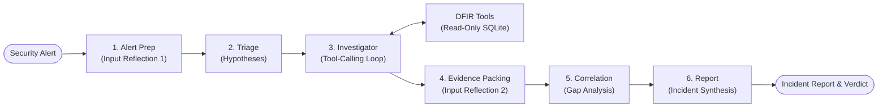

# Investigation Agent Using Agentic Ai 

This is an autonomous Digital Forensics and Incident Response (DFIR) investigation agent built with **LangGraph**, **LangChain**, and **SQLite**. It ingests raw security alerts (e.g. suspicious process execution, network beaconing, registry persistence), formulates investigation hypotheses, navigates an endpoint security telemetry database using dedicated forensic tools, correlates findings, and synthesizes structured forensic incident reports with verdicts and confidence scores.

| Component | Details |
| --- | --- |
| **Language** | Python >= 3.12 |
| **Interfaces** | Terminal CLI, Web UI (FastAPI + SSE), scenario benchmark |
| **Agent Stack** | LangGraph, LangChain |
| **Telemetry** | Read-only SQLite endpoint security database |
| **Model Providers** | Ollama (local or Cloud) and OpenAI, selectable at runtime |

## Quick Reference & Documentation

-  **[ARCHITECTURE.md](ARCHITECTURE.md)** — Complete architectural diagrams, routing contracts, file catalog, and internal guardrails.
-  **[endpoint_security_dataset_expanded_corrected/README.md](endpoint_security_dataset_expanded_corrected/README.md)** — Dataset provenance and agent/evaluator surface split.
-  **[endpoint_security_dataset_expanded_corrected/schema.md](endpoint_security_dataset_expanded_corrected/schema.md)** — Telemetry database schema specification.

---

## System Architecture & Pipeline



The investigator autonomously queries telemetry through 8 specialized DFIR tools, looping until sufficient evidence is collected, the step cap (`MAX_INVESTIGATION_STEPS = 12`) is reached, or the repetition circuit breaker trips.

### Key Guardrails & Determinism

- **Read-Only Database Access:** SQLite connections are strictly opened in `mode=ro`. Only single `SELECT`, `PRAGMA`, or `WITH` queries are allowed; write operations and chained queries are blocked at the engine layer.
- **Evidence Gate & Loop Breaker:** The agent cannot exit prematurely without querying tools (`MIN_INVESTIGATION_STEPS = 2`). A circuit breaker detects duplicate queries and terminates loops gracefully (`MAX_REPEAT_NUDGES = 2`).
- **Structured Output Reliability:** All critical outputs (triage plans, correlations, final reports) enforce schema validation with an automated retry-once mechanism (`invoke_structured_with_retry()`).

---

## Directory Structure

```text
ai-musefix/
├── pyproject.toml                 # Package metadata, console scripts (a1, a1-web), deps
├── uv.lock                        # Locked dependency graph (uv)
├── requirements.txt               # Dependencies list
├── .python-version                # Pinned interpreter for uv (>= 3.12)
├── .env.example                   # Environment variable template
├── README.md / ARCHITECTURE.md    # Project documentation / full architecture guide
├── src/a1/
│   ├── cli.py         # CLI investigations, --web launch, --benchmark, LLM & DB selection
│   ├── config.py      # Env parsing, path resolution, step limits
│   ├── db.py          # Read-only SQLite wrapper + temporary convenience views
│   ├── llm.py         # Ollama / OpenAI chat-model factory + runtime override
│   ├── state.py       # LangGraph InvestigationState TypedDict
│   ├── graph.py       # StateGraph assembly, routing, and compilation
│   ├── benchmark.py   # Labeled-scenario benchmark runner
│   ├── nodes/         # alert_prep, triage, investigator, evidence_packing, correlation, report
│   ├── tools/         # query, process, association, timeline, entity, pivot
│   ├── prompts/       # Per-node system prompts
│   └── web/           # FastAPI backend + chat UI (HTML/CSS/JS)
├── tests/                         # Full pytest suite + conftest DB selection + smoke test
└── endpoint_security_dataset_expanded_corrected/   # Telemetry DBs + groundtruth/ subfolder
    ├── groundtruth/               # Scenario ground truth files (ATK-A through ATK-F)
    └── *.db                       # Forensic telemetry SQLite databases
```

---

## Installation & Setup

### 1. Environment Setup

Requires **Python >= 3.12**.

Using **`uv`** :
```bash
uv sync
```

### 2. Configure Environment

Copy the `.env.example` template:
```bash
cp .env.example .env          # Windows: copy .env.example .env
```

The default configuration uses Ollama Cloud with `gemma4:31b` (no local Ollama daemon required). Simply set your `OLLAMA_API_KEY` in `.env`, or configure local Ollama / OpenAI credentials.

### 3. Shipped Telemetry Databases

The repository includes six forensic attack telemetry databases with evaluator ground truth isolated in `endpoint_security_dataset_expanded_corrected/groundtruth/`:

| Database | Scenario | Hosts | Users | Events | Ground Truth |
| :--- | :--- | ---: | ---: | ---: | :--- |
| `attack_lateral_movement.db` | **ATK-A**: Credential access & lateral movement | 2 | 3 | 127 | `groundtruth/groundtruth_attack_A_lateral_movement.json` |
| `attack_data_exfiltration.db` | **ATK-B**: Data staging, persistence & exfiltration | 1 | 1 | 83 | `groundtruth/groundtruth_attack_B_data_exfiltration.json` |
| `ransomware_attack_complete_ecs.db` | **ATK-C**: Ransomware file encryption (LockBit) | 1 | 1 | 1,450 | `groundtruth/groundtruth_attack_C_ransomware.json` |
| `attack_lotl_fileless.db` | **ATK-D**: Living-off-the-Land & fileless in-memory C2 | 2 | 2 | 240 | `groundtruth/groundtruth_attack_D_lotl_fileless.json` |
| `wazuh_lotl_attack_dataset.db` | **ATK-E**: Wazuh SIEM/EDR, LotL & SAM registry access | 2 | 2 | 320 | `groundtruth/groundtruth_attack_E_wazuh_lotl.json` |
| `suricata_c2_intrusion.db` | **ATK-F**: Suricata NIDS CobaltStrike C2 beaconing & exfil | 3 | 1 | 59 | `groundtruth/groundtruth_attack_F_suricata.json` |

`config.py` automatically discovers and mounts the first available database out of the box.

---

## Usage Guide

### 1. Web Interface 

Launch the interactive web UI with real-time SSE event streaming, database switching, and model selection:

```bash
a1 web
# or:
python -m a1.web.server
# or:
python -m a1.cli --web
```

Open [http://127.0.0.1:8000/](http://127.0.0.1:8000/) in your browser. You can select your model and target telemetry database directly from the header dropdowns.

---

### 2. CLI Investigations

Run targeted forensic investigations from the command line using the `--db` flag to point to the desired scenario.

#### Scenario 1: Credential Access & Lateral Movement (`ATK-A`)

> **Prompt:** *Investigate suspicious PowerShell activity on WS-OPS-01 on 2026-09-10. Determine whether there is evidence of credential access or movement to another host. Trace relevant process, file, authentication, network, and service activity; distinguish confirmed evidence from gaps and do not assume maliciousness.*

```bash
python -m a1.cli "Investigate suspicious PowerShell activity on WS-OPS-01 on 2026-09-10. Determine whether there is evidence of credential access or movement to another host. Trace relevant process, file, authentication, network, and service activity; distinguish confirmed evidence from gaps and do not assume maliciousness." --db endpoint_security_dataset_expanded_corrected/attack_lateral_movement.db
```

#### Scenario 2: Data Staging & Exfiltration (`ATK-B`)

> **Prompt:** *Investigate unusual file-staging and outbound network activity on WS-DEV-02 on 2026-09-11. Trace relevant process, archive, scheduled-task, network, and file-deletion activity. Assess whether the evidence supports data exfiltration, note evidence gaps, and avoid treating unrelated authentication activity as proof.*

```bash
python -m a1.cli "Investigate unusual file-staging and outbound network activity on WS-DEV-02 on 2026-09-11. Trace relevant process, archive, scheduled-task, network, and file-deletion activity. Assess whether the evidence supports data exfiltration, note evidence gaps, and avoid treating unrelated authentication activity as proof." --db endpoint_security_dataset_expanded_corrected/attack_data_exfiltration.db
```

#### Scenario 3: Suricata NIDS CobaltStrike C2 Intrusion (`ATK-F`)

> **Prompt:** *Investigate critical Suricata NIDS alerts on WS-FINANCE-01 (192.168.1.105): multiple ET MALWARE CobaltStrike C2 beaconing alerts to 203.0.113.88:8443 between 2026-10-16T14:00:00Z and 2026-10-16T16:02:00Z. Determine whether this is a malicious intrusion or benign administrative activity.*

```bash
python -m a1.cli "Investigate critical Suricata NIDS alerts on WS-FINANCE-01 (192.168.1.105): multiple ET MALWARE CobaltStrike C2 beaconing alerts to 203.0.113.88:8443 between 2026-10-16T14:00:00Z and 2026-10-16T16:02:00Z" --db endpoint_security_dataset_expanded_corrected/suricata_c2_intrusion.db
```

#### Common CLI Flags

| Flag | Description |
| :--- | :--- |
| `alert` / `-q, --query` | Alert text / prompt to investigate |
| `--db` | Path to a specific SQLite telemetry database |
| `-p, --provider` | Model provider (`ollama` or `openai`) |
| `-m, --model` | Specific model name / tag (e.g. `gemma4:31b`, `gpt-4o-mini`) |
| `--select-llm` | Interactively select provider and available models |
| `-v, --verbose` | Stream detailed reasoning, SQL queries, and tool I/O to console |
| `--web` | Launch the FastAPI web server |
| `--benchmark` | Run the ground-truth benchmark evaluation |

---

### 3. Benchmark Runner

Evaluate agent accuracy and reasoning against labeled ground truth across all 6 shipped attack scenarios (labels loaded from `endpoint_security_dataset_expanded_corrected/groundtruth/`):

```bash
python -m a1.benchmark
# or with a limit:
python -m a1.cli --benchmark --limit 6
```

The benchmark switches telemetry databases automatically per scenario, validates verdicts against ground truth, and tracks whether structured-output fallbacks were triggered.

---

### 4. Running Tests

Run the full pytest suite and standalone smoke tests:

```bash
# Run test suite
pytest tests/

# Run standalone smoke test (17 end-to-end checks)
python tests/smoke_test.py
```

Test fixtures dynamically query the active database at runtime to support any valid dataset schema.

---

## Configuration Reference

Configure `a1` via `.env` or system environment variables:

| Variable | Default | Purpose |
| :--- | :--- | :--- |
| `LLM_PROVIDER` | `ollama` | `ollama` or `openai` |
| `OLLAMA_MODEL_NAME` | `gemma4:31b` | Ollama model tag |
| `OLLAMA_BASE_URL` | `https://ollama.com/api` | Base URL (trailing `/api` auto-handled) |
| `OLLAMA_NUM_CTX` | `32768` | Ollama context window size |
| `OLLAMA_API_KEY` | *(empty)* | API key / Bearer token for Ollama Cloud |
| `OPENAI_MODEL_NAME` | `gpt-4o-mini` | OpenAI model name |
| `OPENAI_API_KEY` | *(empty)* | OpenAI API key |
| `OPENAI_BASE_URL` | *(empty)* | Optional custom OpenAI base URL |
| `ENDPOINT_DB_PATH` | Auto-discovered | Path to active SQLite telemetry database |
| `MAX_INVESTIGATION_STEPS` | `12` | Investigator loop cap before forcing correlation |

---
