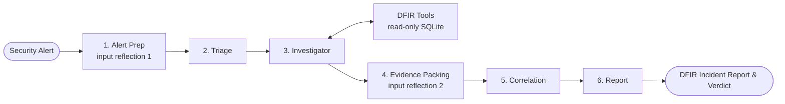

# `a1`: Autonomous DFIR Investigation Agent

`a1` is an autonomous Digital Forensics and Incident Response (DFIR) investigation agent built with **LangGraph**, **LangChain**, and **SQLite**. It takes raw security alerts (e.g. suspicious process execution, network beaconing, registry persistence), formulates investigation hypotheses, navigates an endpoint security telemetry database using dedicated forensic tools, correlates findings, and synthesizes structured forensic incident reports with verdicts and confidence scores.

| | |
| :--- | :--- |
| **Language** | Python >= 3.12 |
| **Interfaces** | Terminal CLI, ChatGPT-style web UI (FastAPI + SSE), scenario benchmark |
| **Agent stack** | LangGraph `StateGraph`, LangChain chat models with `bind_tools` |
| **Telemetry** | Read-only SQLite endpoint security database (URI `mode=ro`) |
| **Model providers** | Ollama (local or Cloud) and OpenAI, selectable at runtime |

---

## Quick Reference & Visualization

For a complete breakdown of every file, its functional label, guardrails, routing rules and architectural diagrams, see:
👉 **[ARCHITECTURE.md](ARCHITECTURE.md)**

Dataset documentation:
- [endpoint_security_dataset_expanded_corrected/README.md](endpoint_security_dataset_expanded_corrected/README.md) — dataset provenance and agent/evaluator surface split
- [endpoint_security_dataset_expanded_corrected/schema.md](endpoint_security_dataset_expanded_corrected/schema.md) — telemetry schema specification

---

## Pipeline Overview



The investigator loops over the tool node until it has collected enough evidence, reaches the step cap, or trips the repetition circuit breaker. Exact routing conditions: [ARCHITECTURE.md, section 1](ARCHITECTURE.md#1-system-architecture--workflow).

---

## Directory Structure

```text
ai-musefix/
├── pyproject.toml                 # Metadata, `a1` / `a1-web` entrypoints, deps, pytest config
├── uv.lock                        # Locked dependency graph (uv)
├── requirements.txt               # Legacy short-form list; pyproject.toml is authoritative
├── .python-version                # Pinned interpreter for uv
├── .env.example                   # Environment template
├── README.md / ARCHITECTURE.md    # Project overview / full architecture guide
├── src/a1/
│   ├── cli.py         # CLI investigations, --web launch, --benchmark, LLM & DB selection
│   ├── server.py      # Web server entrypoint (`python -m a1.server`)
│   ├── config.py      # Env parsing, path resolution, step limits
│   ├── db.py          # Read-only SQLite wrapper + temp convenience views
│   ├── llm.py         # Ollama / OpenAI chat-model factory + runtime override
│   ├── state.py       # LangGraph InvestigationState TypedDict
│   ├── graph.py       # StateGraph assembly, routing and compilation
│   ├── benchmark.py   # Labeled-scenario benchmark runner
│   ├── nodes/         # alert_prep, triage, investigator, evidence_packing, correlation, report
│   ├── tools/         # query, process, association, timeline, entity, pivot
│   ├── prompts/       # Per-node system prompts
│   └── web/           # FastAPI app + static chat UI
├── tests/                         # pytest suite + conftest DB selection + standalone smoke test
└── endpoint_security_dataset_expanded_corrected/   # Telemetry DBs + ground truth
```

Annotated tree with per-file labels: [ARCHITECTURE.md, section 2](ARCHITECTURE.md#2-directory-tree-with-file-labels).

---

## Quickstart

### 1. Environment Setup

Requires **Python >= 3.12** (see `pyproject.toml`).

```bash
# With uv (uv.lock is committed)
uv sync
```
Or with pip:
```bash
python -m venv .venv
.venv\Scripts\activate        # Windows
pip install -e .
```

Copy the environment template:
```bash
cp .env.example .env          # Windows: copy .env.example .env
```
The default configuration uses Ollama Cloud with `gemma4:31b`; no local Ollama server is required. Set `OLLAMA_API_KEY` in `.env` before running the agent.

### 2. Telemetry Database

`config.py` discovers the first existing telemetry database (`agent_bundle/agent_endpoint_security.db` → `attack_lateral_movement.db` → `attack_data_exfiltration.db`), so no configuration is needed out of the box. Two attack databases ship with this repository:

| Database | Hosts | Users | Events | Ground truth |
| :--- | ---: | ---: | ---: | :--- |
| `attack_lateral_movement.db` | 2 | 3 | 127 | `groundtruth_attack_A_lateral_movement.json` |
| `attack_data_exfiltration.db` | 1 | 1 | 83 | `groundtruth_attack_B_data_exfiltration.json` |

Select a database with the `--db` flag, the `ENDPOINT_DB_PATH` variable, or the database dropdown in the web UI:

```bash
python -m a1.cli "Investigate possible credential dumping on WS-OPS-01" --db endpoint_security_dataset_expanded_corrected/attack_lateral_movement.db
```

### 3. Running the Web Interface (ChatGPT-Style UI)

```bash
a1-web                     # installed console script
python -m a1.server        # module entrypoint
python -m a1 --web         # via the CLI
python -m a1.cli --web     # via the CLI
```
Options: `--host` (default `127.0.0.1`), `--port` (default `8000`), `--no-browser`.

Open [http://127.0.0.1:8000/](http://127.0.0.1:8000/). The UI streams node progress over SSE and exposes both a model selector and a telemetry-database selector.

### 4. Running a CLI Investigation

```bash
python -m a1.cli "Investigate suspicious PowerShell execution on WS-OPS-01"
python -m a1 "Investigate unusual outbound connection from SRV-FILE-01" --verbose
```
Useful flags: `--provider/-p`, `--model/-m`, `--select-llm`, `--verbose/-v`, `--db`, `--benchmark`, `--limit`, `--query/-q`.

### 5. Running the Benchmark

```bash
python -m a1.benchmark
python -m a1.cli --benchmark --limit 5
```
The benchmark scores verdict and verdict-boundary accuracy against per-case labels, and counts structured-output fallback runs as automatic failures. It runs two cases (`ATK-A` lateral movement, `ATK-B` exfiltration), switching to each scenario's database automatically. Labels come from `case_labels.json` when the original bundle is present, otherwise from the shipped `groundtruth_attack_*.json` files. Note the honesty caveat in `benchmark.py`: both shipped scenarios expect `malicious`, so the benchmark measures whether a real attack chain gets found, not benign-vs-malicious discrimination.

### 6. Running Tests

```bash
pytest tests/                 # 55 passed, 1 skipped
python tests/smoke_test.py    # 17 checks, standalone
```

`tests/conftest.py` points the suite at a telemetry database that ships with the repository (preferring `attack_lateral_movement.db`) unless you set `ENDPOINT_DB_PATH` yourself, so no configuration is needed to run the suite. Database-backed tests discover their fixtures from the active database at runtime rather than hard-coding dataset identifiers.

Test coverage by file: `test_db.py` (read-only guardrails, schema inspection), `test_tools.py` (each forensic tool), `test_graph.py` (graph compilation, investigator nudge behaviour), `test_input_reflection.py` (alert prep, evidence packing, verdict JSON recovery), `test_report.py` (verdict normalisation, citation/path sanitisation, correlation-driven verdicts), `test_structured_output.py` (retry-once-then-fail contract), `test_web.py` (FastAPI endpoints), `smoke_test.py` (standalone end-to-end script, skipped under pytest).

---

## Configuration

| Variable | Default | Purpose |
| :--- | :--- | :--- |
| `LLM_PROVIDER` | `ollama` | `ollama` or `openai` |
| `OLLAMA_MODEL_NAME` | `gemma4:31b` | Ollama model tag |
| `OLLAMA_BASE_URL` | `https://ollama.com/api` | Base URL (a trailing `/api` is stripped) |
| `OLLAMA_NUM_CTX` | `32768` | Ollama context window |
| `OLLAMA_API_KEY` | *(empty)* | Bearer token for Ollama Cloud |
| `OPENAI_MODEL_NAME` | `gpt-4o-mini` | OpenAI model; pair with `OPENAI_API_KEY` / `OPENAI_BASE_URL` |
| `ENDPOINT_DB_PATH` | first existing DB: `agent_bundle/agent_endpoint_security.db` → `attack_lateral_movement.db` → `attack_data_exfiltration.db` | Telemetry database path |
| `MAX_INVESTIGATION_STEPS` | `12` | Investigator loop cap before forced correlation |

---

## Repository Status (Gaps Before First Commit)

These are documented so the first commit is not misleading:

1. **Default database now resolves to a shipped DB.** `config.py` discovers the first existing database (`agent_bundle/agent_endpoint_security.db` → `attack_lateral_movement.db` → `attack_data_exfiltration.db`), so CLI and web runs work with no configuration. A `--db` flag or `ENDPOINT_DB_PATH` still overrides it, and `config.set_active_database()` lets the CLI, web API and benchmark switch databases cleanly.
2. **Benchmark runs against the shipped scenarios.** `benchmark.py` scores two cases (`ATK-A` on `attack_lateral_movement.db`, `ATK-B` on `attack_data_exfiltration.db`, switching databases per case) with labels from `case_labels.json` when present, otherwise derived from the shipped `groundtruth_attack_*.json` files. Scoring caveat: both shipped scenarios expect `malicious`, so the benchmark measures attack-chain discovery, not benign-vs-malicious discrimination.
3. **Tests discover fixtures at runtime** instead of hard-coding identifiers from the deleted five-scenario bundle: database-backed tests query the active telemetry database for a real host, process pair, indicator or event. Verified result: `pytest tests/` → **55 passed, 1 skipped** and `python tests/smoke_test.py` → **17 passed**, both against either shipped attack database.
4. **`project_overview.html` is a 0-byte placeholder** and is currently untracked.


