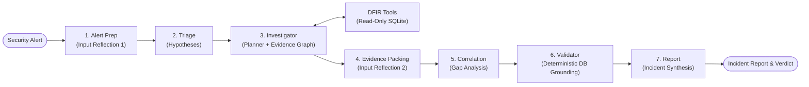

# A1: Autonomous Agentic AI Investigator for Endpoint Telemetry & DFIR

A1 is an autonomous Digital Forensics and Incident Response (DFIR) investigation engine built with **LangGraph**, **LangChain**, and **SQLite**. Given raw security alerts (e.g. suspicious process execution, lateral movement, data staging, ransomware, Living-off-the-Land), A1 formulates competing hypotheses, navigates endpoint telemetry databases using specialized forensic tools, constructs an explicit **Evidence Graph**, correlates multi-host activity, deterministically validates evidence citations against raw telemetry, and synthesizes structured, audit-ready DFIR incident reports with verifiable verdicts and confidence scores.

| Component | Details |
| --- | --- |
| **Language** | Python >= 3.12 |
| **Interfaces** | Terminal CLI, Web UI (FastAPI + SSE + Interactive Forensic DAG), Scenario Benchmark, Experiment Runner |
| **Agent Stack** | LangGraph cyclical state machine, LangChain |
| **Telemetry Engine** | Safe, read-only SQLite endpoint security databases (8 shipped datasets) |
| **Model Providers** | Ollama (local or Cloud) and OpenAI, selectable at runtime |

## Quick Reference & Documentation

- **[ARCHITECTURE.md](ARCHITECTURE.md)** — Complete architectural diagrams, routing contracts, file catalog, and internal guardrails.
- **[docs/EVALUATION_SCORING_RUBRICS.md](docs/EVALUATION_SCORING_RUBRICS.md)** — 100-point multi-dimensional evaluation rubric, scoring criteria, and ablation study guidelines.
- **[endpoint_security_dataset_expanded_corrected/README.md](endpoint_security_dataset_expanded_corrected/README.md)** — Dataset provenance, shipped databases, and agent/evaluator surface boundary.
- **[endpoint_security_dataset_expanded_corrected/schema.md](endpoint_security_dataset_expanded_corrected/schema.md)** — Telemetry database schema specification.

---

## System Architecture & Pipeline



The investigator autonomously queries telemetry through 8 specialized DFIR tools, looping until sufficient evidence is collected, the step cap (`MAX_INVESTIGATION_STEPS = 12`) is reached, or the repetition circuit breaker trips.

### Key Architectural Capabilities

- **Explicit Evidence Graph (`a1/evidence_graph.py`):** Maintains a directed entity-relationship DAG (`Host`, `User`, `Process`, `File`, `IP`, `Domain`, `RegistryKey`) citing specific `event_id` anchors. Feeds interactive Cytoscape/D3/SVG graph rendering in the web interface.
- **Adaptive Investigation Planner (`a1/nodes/planner_node.py`):** Dynamically ranks candidate forensic queries by expected information gain, avoiding redundant steps and prioritizing unresolved hypothesis gaps.
- **Hypothesis State Tracking (`a1/hypothesis.py`):** Explicitly tracks the lifecycle (`UNTESTED`, `SUPPORTED`, `REFUTED`, `INCONCLUSIVE`) of competing explanations to avoid confirmation bias.
- **Deterministic Evidence Validation (`a1/nodes/validator_node.py`):** Queries SQLite directly to verify 100% of cited event IDs, process entities, and hashes before reports are finalized, enforcing zero-hallucination standards.
- **Forensic Guardrails:** Read-only SQLite access (`mode=ro`), strict single-query `SELECT`/`PRAGMA`/`WITH` enforcement, loop circuit breakers (`MAX_REPEAT_NUDGES = 2`), and minimum evidence gates (`MIN_INVESTIGATION_STEPS = 2`).

---

## Directory Structure

```text
ai-musefix/
├── pyproject.toml                 # Package metadata, console scripts (a1, a1-web), deps
├── uv.lock                        # Locked dependency graph (uv)
├── requirements.txt               # Dependencies list
├── .python-version                # Pinned interpreter (>= 3.12)
├── .env.example                   # Environment variable template
├── README.md / ARCHITECTURE.md    # Project overview / full architecture guide
├── docs/
│   └── EVALUATION_SCORING_RUBRICS.md # 100-point multi-dimensional benchmark rubrics
├── src/a1/
│   ├── cli.py                     # CLI investigations, --web launch, --benchmark, LLM & DB selection
│   ├── config.py                  # Env parsing, path resolution, step limits
│   ├── db.py                      # Read-only SQLite wrapper + convenience virtual views
│   ├── llm.py                     # Ollama / OpenAI chat-model factory + runtime overrides
│   ├── state.py                   # LangGraph InvestigationState TypedDict
│   ├── graph.py                   # 7-node StateGraph assembly, routing, and compilation
│   ├── benchmark.py               # 10-scenario labeled benchmark runner
│   ├── evidence_graph.py          # Entity-relationship DAG and UI serialization
│   ├── hypothesis.py              # Competing hypothesis lifecycle tracker
│   ├── investigation_trace.py     # Structured investigation audit ledger
│   ├── experiment.py              # Baseline comparison & ablation study runner
│   ├── baseline_context.py        # Enterprise administrative baseline profiles
│   ├── nodes/                     # alert_prep, triage, investigator, planner, evidence_packing, correlate, validator, report
│   ├── tools/                     # query, process, association, timeline, entity, pivot, summary
│   ├── prompts/                   # Per-node forensic system prompts
│   └── web/                       # FastAPI backend + interactive DFIR workbench UI
│       ├── server.py              # Web server with SSE event streaming
│       └── static/                # HTML/CSS/JS with SVG forensic DAG & process tree engine
├── scripts/
│   └── smoke_test.py              # Standalone 17-point end-to-end verification script
├── tests/                         # Pytest test suite (78 tests passed)
└── endpoint_security_dataset_expanded_corrected/
    ├── groundtruth/               # Ground truth JSON files (ATK-A..G, BEN-A, AMB-A, INC-A)
    └── *.db                       # 8 SQLite forensic telemetry databases
```

---

## Installation & Setup

### 1. Environment Setup

Requires **Python >= 3.12**.

Using **`uv`**:
```bash
uv sync
```

Or using standard `pip`:
```bash
python -m venv .venv
.\.venv\Scripts\activate          # Windows PowerShell: .venv\Scripts\Activate.ps1
pip install -r requirements.txt
```

### 2. Configure Environment

Copy the `.env.example` template:
```bash
cp .env.example .env              # Windows: copy .env.example .env
```

The default configuration uses Ollama Cloud with `gemma4:31b` (no local Ollama daemon required). Simply set your `OLLAMA_API_KEY` in `.env`, or configure local Ollama / OpenAI credentials.

### 3. Shipped Telemetry Databases

The repository includes eight forensic telemetry databases with evaluator ground truth isolated in `endpoint_security_dataset_expanded_corrected/groundtruth/`:

| Database | Scenario | Hosts | Users | Events | Ground Truth |
| :--- | :--- | ---: | ---: | ---: | :--- |
| `attack_lateral_movement.db` | **ATK-A**: Credential access & lateral movement<br/>**INC-A**: Missing telemetry / inconclusive | 2 | 3 | 127 | `groundtruth/groundtruth_attack_A_lateral_movement.json`<br/>`groundtruth/groundtruth_incomplete_A_missing_telemetry.json` |
| `attack_data_exfiltration.db` | **ATK-B**: Data staging, persistence & exfiltration | 1 | 1 | 83 | `groundtruth/groundtruth_attack_B_data_exfiltration.json` |
| `ransomware_attack_complete_ecs.db` | **ATK-C**: Ransomware file encryption (LockBit) | 1 | 1 | 1,450 | `groundtruth/groundtruth_attack_C_ransomware.json` |
| `attack_lotl_fileless.db` | **ATK-D**: Living-off-the-Land & fileless in-memory C2<br/>**AMB-A**: Ambiguous developer activity | 2 | 2 | 240 | `groundtruth/groundtruth_attack_D_lotl_fileless.json`<br/>`groundtruth/groundtruth_ambiguous_A_dev_activity.json` |
| `wazuh_lotl_attack_dataset.db` | **ATK-E**: Wazuh SIEM/EDR, LotL & SAM registry access | 2 | 2 | 320 | `groundtruth/groundtruth_attack_E_wazuh_lotl.json` |
| `suricata_c2_intrusion.db` | **ATK-F**: Suricata NIDS CobaltStrike C2 beaconing & exfil | 3 | 1 | 59 | `groundtruth/groundtruth_attack_F_suricata.json` |
| `attack_supply_chain.db` | **ATK-G**: Enterprise Supply Chain software compromise | 32 | 32 | 1,890 | `groundtruth/groundtruth_attack_G_supply_chain.json` |
| `benign_admin_activity.db` | **BEN-A**: Benign administrative backup verification script | 1 | 2 | 75 | `groundtruth/groundtruth_benign_A_admin_activity.json` |

`config.py` automatically discovers and mounts the first available database out of the box.

---

## Usage Guide

### 1. Web Interface

Launch the interactive web UI with real-time SSE event streaming, database switching, and model selection:

```bash
a1 web
# or:
python -m a1.web.server
# or:
python -m a1.cli --web
```

Open [http://127.0.0.1:8000/](http://127.0.0.1:8000/) in your browser. The web workbench features:
- **Streaming Investigation Console:** Live step-by-step reasoning, tool invocations, and findings.
- **Interactive Forensic DAG:** Dynamic SVG visualization of observed processes, network connections, files, and users.
- **Process Tree Engine:** Hierarchical process ancestry tree traversal.
- **Model & Database Switchers:** Hot-swap models (Ollama/OpenAI) and telemetry datasets directly in the UI.

---

### 2. CLI Investigations

Run targeted forensic investigations from the command line using the `--db` flag to point to the desired scenario.

#### Malicious Intrusion: Credential Access & Lateral Movement (`ATK-A`)

```bash
python -m a1.cli "Investigate suspicious PowerShell activity on WS-OPS-01 on 2026-09-10. Determine whether there is evidence of credential access or movement to another host. Trace relevant process, file, authentication, network, and service activity; distinguish confirmed evidence from gaps and do not assume maliciousness." --db endpoint_security_dataset_expanded_corrected/attack_lateral_movement.db
```

#### Benign Administrative Operation: Backup Verification (`BEN-A`)

```bash
python -m a1.cli "Investigate scheduled activity on WS-ADMIN-05: svchost.exe spawned PowerShell running backup_verification.ps1 under CORP\\sysadmin, which opened SMB connections to SRV-FILE-02, wrote to backup_audit_20260915.log, and checked W32Time registry settings. Determine whether this is an attack or benign administrative activity." --db endpoint_security_dataset_expanded_corrected/benign_admin_activity.db
```

#### Incomplete Telemetry: Missing Ancestry & Flows (`INC-A`)

```bash
python -m a1.cli "Investigate an alert claiming unauthorized execution on SRV-FILE-01. Examine telemetry for the parent process, network flows, and authentication. If essential telemetry is absent to prove or disprove malicious activity, render an inconclusive outcome citing the specific missing telemetry." --db endpoint_security_dataset_expanded_corrected/attack_lateral_movement.db
```

#### Common CLI Flags

| Flag | Description |
| :--- | :--- |
| `alert` / `-q, --query` | Alert text / prompt to investigate |
| `--db` | Path to a specific SQLite telemetry database |
| `-p, --provider` | Model provider (`ollama` or `openai`) |
| `-m, --model` | Specific model name / tag (e.g. `gemma4:31b`, `gpt-4o-mini`) |
| `--select-llm` | Interactively select provider and available models |
| `-v, --verbose` | Stream detailed reasoning, SQL queries, and tool I/O to console |
| `--web` | Launch the FastAPI web server |
| `--benchmark` | Run the ground-truth benchmark evaluation |

---

### 3. Benchmark Runner & Evaluation

Evaluate agent accuracy and reasoning across all 10 shipped scenarios covering malicious intrusions, benign operations, ambiguous tasks, and incomplete telemetry:

```bash
# Run complete benchmark
python -m a1.benchmark

# Run with a limit of cases
python -m a1.cli --benchmark --limit 5
```

The benchmark switches telemetry databases automatically per scenario, validates verdicts against ground truth, measures False Positive Rate (FPR) and False Negative Rate (FNR), audits evidence grounding against SQLite tables, and computes composite 100-point scores.

---

### 4. Baseline Comparison & Ablation Experiments

Run empirical ablation experiments (`src/a1/experiment.py`) comparing system configurations:

```bash
# Run baseline comparison and ablation studies
python -m a1.experiment

# Run live ablation studies with real LangGraph workflow executions and rubric scoring
python -m a1.experiment --live --limit 3
```

Configurations tested:
- **Baseline:** Un-augmented LLM ReAct agent.
- **+ Evidence Graph:** Explicit entity-relationship DAG tracking.
- **+ Adaptive Planner:** Information-gain prioritized querying.
- **+ Evidence Validator:** Zero-hallucination deterministic database verification.
- **Full Architecture:** All augmentations enabled.

When run with `--live`, each scenario executes through the compiled LangGraph state machine, audits grounding against SQLite, scores outcomes using the 100-point rubric in `docs/EVALUATION_SCORING_RUBRICS.md`, and exports detailed summaries to `experiment_report.json` and `experiment_report.md`.

---

### 5. Running Tests

Run the full pytest suite (78 tests passed) and standalone smoke tests:

```bash
# Run pytest suite
.venv\Scripts\python.exe -m pytest tests/

# Run standalone smoke test (17 end-to-end checks)
.venv\Scripts\python.exe scripts/smoke_test.py
```

---

## Configuration Reference

Configure `a1` via `.env` or system environment variables:

| Variable | Default | Purpose |
| :--- | :--- | :--- |
| `LLM_PROVIDER` | `ollama` | `ollama` or `openai` |
| `OLLAMA_MODEL_NAME` | `gemma4:31b` | Ollama model tag |
| `OLLAMA_BASE_URL` | `https://ollama.com/api` | Base URL (trailing `/api` auto-handled) |
| `OLLAMA_NUM_CTX` | `32768` | Ollama context window size |
| `OLLAMA_API_KEY` | *(empty)* | API key / Bearer token for Ollama Cloud |
| `OPENAI_MODEL_NAME` | `gpt-4o-mini` | OpenAI model name |
| `OPENAI_API_KEY` | *(empty)* | OpenAI API key |
| `OPENAI_BASE_URL` | *(empty)* | Optional custom OpenAI base URL |
| `ENDPOINT_DB_PATH` | Auto-discovered | Path to active SQLite telemetry database |
| `MAX_INVESTIGATION_STEPS` | `12` | Investigator loop cap before forcing correlation |
